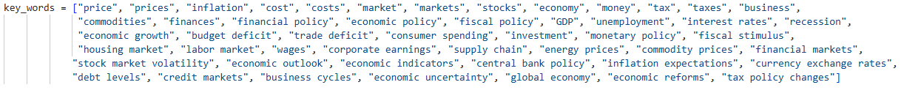
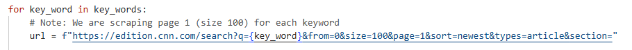
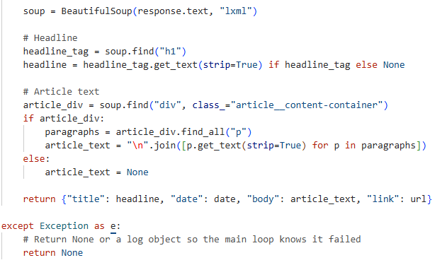
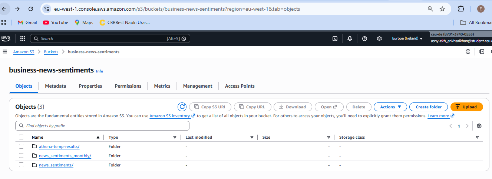
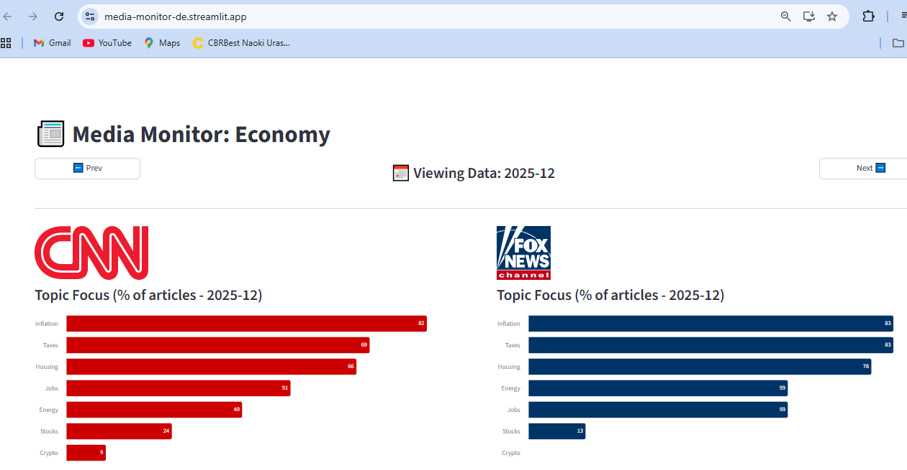
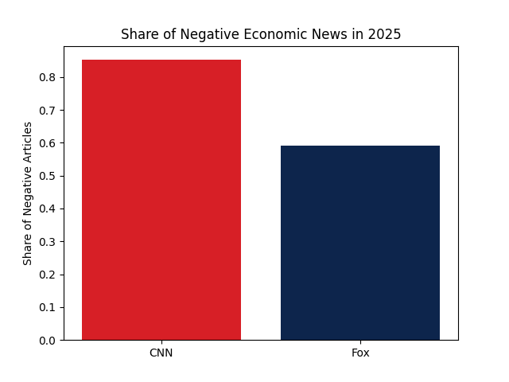
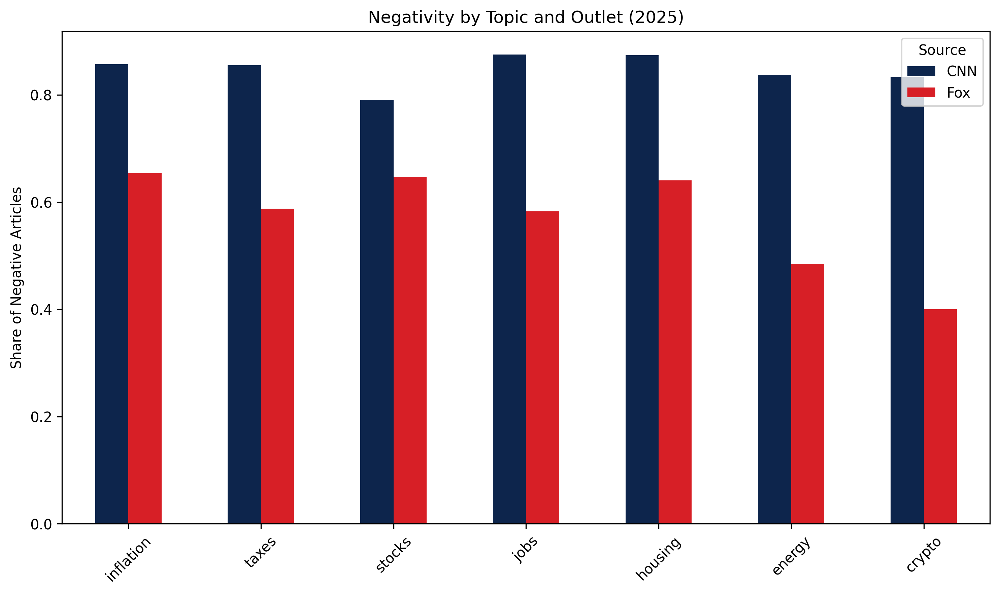

<h1 style="text-align: center;">How Conservative and Liberal News Media See Current Economic Condition: CNN vs. Fox News</h1>

**Author:** Enkhsaikhan Usny-Ekh, Ambrus Fodor 

## Introduction 
Economic conditions are not only shaped by objective indicators such as inflation, employment, or growth, but also by how these indicators are interpreted and communcated to the public. News media play a central role in shaping public perceptions of economy, influencing consumer confidence and politiccal attitutes. This report examines how liberal and conservative news media differ in their portrayal of the U.S. economic situations, focusing on a comparative case study of CNN and Fox News. CNN is commonly associated with a liberal-leaning audience, while Fox News is widely regarded as representing conservative viewpoints. 

The economic news articles were scraped direclty from CNN and Fox News websites. Each article processed using **AWS Bedrock Nova** for automatic categorization and sentiment analysis, classifying it by topic (e.g., inflation, taxes, employment, housing, energy, financial markets) and sentiment (positive or negative). The data were stored in **AWS S3**, and, as an additional feature, a Streamlit dashboard was created to explore topic-level distribution and overall economic sentiment. Querying and processing for the dashboard were facilitated through **AWS Athena** and **AWS Lambda functions**. 

---

## Data source: Web Scraping
We scraped CNN and Fox News using a two-stage web-scraping process: first, we collected news links using the websites' search engines, and then we scraped the full articles using these links. We used two main Python Libraries for this process, Selemium and BeautifulSoup. This section explain the scraping logic for each news outlet separately. 

### 1. CNN Article Scraping  
What makes it possible to scrape economic-related articles from CNN is its dynamic search link. By searching for the keyword 'economy' on CNN's search engine, the following link appears:  
`https://edition.cnn.com/search?q=economy&from=0&size=10&page=1&sort= newest&types=article&section=`
Key details:
* `q=economy` - search term 
* `size=10` - up to 10 results per page 
* `sort=newest` - most recent articles 
* `types=article` - excluding video, galleries 

Using 52 keywords, up to 100 article links and headlines per keyword were scraped. Since CNN’s search engine relies on JavaScript, the scraping was performed using the Selenium package.

After collecting the news links, the full articles were scraped using BeautifulSoup.

### 2. Fox News
The same method is applied to Fox News. Using the Fox News economy category page, article headlines and links were first scrapped by iterating over paginated results: 
`https://www.foxnews.com/category/us/economy?page={page_num}`
The collected links were then used to scrap the full article texts and publication dates. BeautifulSoup was used for both stages of the scrapping process. Finally, scrapped data are saved to AWS S3.

---

## Methods

We processed a collection of news articles for economic relevance and sentiment using AWS Bedrock with the Nova Micro foundation model. 

1. Filtering for Economic Relavance  
Each article title was first analyzed to determine if it was related to economic topics to make sure each artile is about economic related subject.   

2. Topic Categorization  
Filtered articles are further sorted into more specific subjects such as inflation, crypto, trade, or markets. This step is guided by the article content and keyword-based or model-based categorization. 

3. Sentiment Analysis  
For each filtered article, the get_sentiment(text) function uses the same AWS Nova Micro model to classify the article’s tone as POSITIVE or NEGATIVE. The system prompt instructs the model to assess sentiment in relation to the U.S. economy, though the articles themselves may originate from any source. Sentiment results are mapped numerically (1 = positive, 0 = negative) and stored alongside article metadata.

---

## Streamlit
To enhance real-time accessibility, we have developed a dedicated Streamlit application that allows users to monitor the share of negative news and top economic topics on a monthly basis. This interactive tool ensures that as new data is collected, the analysis remains current, providing an up-to-date look at how media narratives shift over time. Users can explore monthly trends, such as the specific focus on topics like inflation, taxes, and housing, and see how these priorities differ between CNN and Fox News. The application is live and can be accessed at the following link: https://media-monitor-de.streamlit.app/.

---
## Results
The analysis is based exclusively on articles published in 2025, comprising 555 articles from CNN and 422 articles from Fox News, all of which were included in the sentiment analysis.

1. The Big Picture: CNN is More Negative
CNN is significantly more negative about the economy than Fox News. About 85% of CNN's economic stories are negative while it is only 59% for Fox News. 

The chart show the monthly share on negative economic news in 2025 for CNN and Fox. CNN consistently reports higher negative, often above 85% and peaking over 90% in March-May. Fox News is lower and more variable, ranging from about 38% to 77%, with spikes in August and November. Overall, CNN maintains a persistently pessimistic tone, while Fox news is less negative and more fluctuating. 

2. Specific Topics (Inflation, Jobs, and Crypto)
The negativity gap shows up in every category, but it’s most extreme in areas like Crypto and Energy. CNN reported negatively on Crypto about 80% of the time, while Fox was much more balanced at 40%. Even for "bread and butter" issues like Jobs, CNN was nearly 30% more negative than Fox.

Why is it like this?
The reason for this split usually comes down to who is in the White House.

**The "Supportive" Media**: In 2025, Fox News (the conservative outlet) is likely more suportive of the administration, emphasizing successes such as job growth or business expansion. 

**The "Watchdog" Media**: CNN (the liberal-leaning outlet) acts as the opposition. They focus on "risks," such as high prices or market instability, to hold the government accountable.

This indicates that economic news is influenced by selective reporting: CNN likely emphasizes negative developments to critique the government, while Fox likely highlights positive news to support it. Coverage of economic issues thus reflects political perspectives as well as underlying data. 

---

## Cost
The total cost to execute the analysis script and process nearly 3,000 articles was 1.334 USD. This includes the one-time sentiment classification using Amazon Nova Micro v1.0 and the foundational AWS infrastructure required to host the data. While the initial setup required a larger investment for bulk processing, the recurring monthly cost to maintain the dashboard is extremely low at less than $0.01 USD. During trial and error, the bedrock prompts were refined and re-run multiple times, but most of the times on smaller datasets. We estimate that the development process costed an addtitional 2-3 USD.  

| Category           | Service Component | Cost Detail                                                   | Total Cost (USD) |
|-------------------|-----------------|---------------------------------------------------------------|----------------|
| AI Model Inference | Amazon Bedrock  | Nova Micro: Bulk processing and classification of 2,960 articles | $1.0916        |
| Compute & Logic    | AWS Lambda      | Script execution time (6245 ms) and miscellaneous processing | $0.2426        |
| Data Storage       | Amazon S3       | Hosting 20.2 MB of economic data and monthly topic logs      | $0.0004        |
| Data Querying      | Amazon Athena   | SQL scanning of JSONL files for dashboard updates           | $0.0001        |
| **Total Script Cost** |                 | Complete execution from zero to live dashboard               | ~$1.334        |
